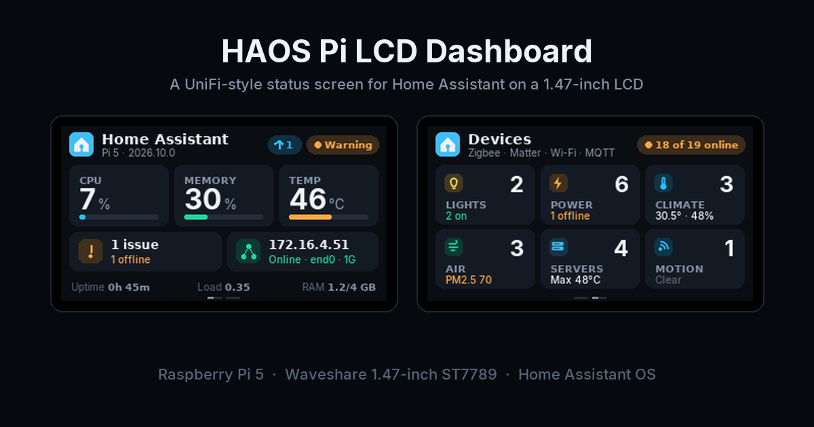
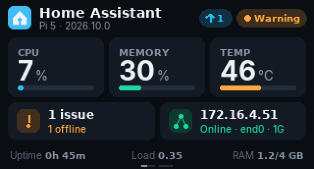
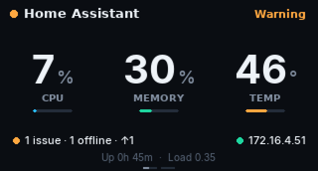
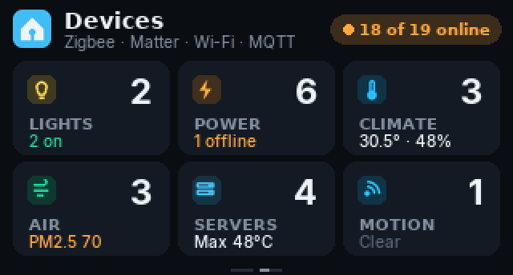
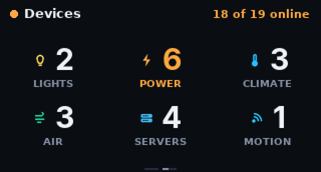

# HAOS Pi LCD Dashboard

A UniFi-style status screen for Home Assistant OS on a Waveshare 1.47" SPI LCD (ST7789V3, 320 × 172) wired to a Raspberry Pi.



It runs as a Home Assistant app (add-on), draws with Python and Pillow, and talks to Home Assistant through the Supervisor, so there is no token to create.

## What it shows

| | Advanced theme | Simple theme |
| --- | --- | --- |
| **System** |  |  |
| **Devices** |  |  |

- **System page**: CPU, memory and temperature, the host IP and link speed, uptime, load and RAM. The header badge reflects the health of the whole installation: Repairs (including Supervisor and OS issues), integrations that fail to load, and offline devices. A cyan ↑ badge counts every pending update (Core, OS, Supervisor, apps, HACS, device firmware).
- **Devices page**: every physical device in Home Assistant, across Zigbee, Matter, Thread, Wi‑Fi and MQTT, grouped into Lights, Power, Climate, Air, Servers, Motion (and optionally Phones), with one useful summary per group.
- **Boot and shutdown screens**: a logo, a thin progress bar and a status line while Home Assistant starts, and *Restarting…* or *Powered off · Safe to unplug* at the end.

The two pages rotate (20 s and 10 s by default). Each part can be controlled from Home Assistant.

## Install

1. Wire the display and enable SPI (see [the documentation](pi_lcd_dashboard/DOCS.md#hardware)).
2. In Home Assistant go to **Settings → Apps → App store**, open the ⋮ menu, choose **Repositories** and add:

   ```
   https://github.com/zen29d/haos-pi-lcd-dashboard
   ```

3. Install **HAOS Pi LCD Dashboard** and start it.

The app creates two helpers on first start: `input_boolean.lcd_display` (screen on/off) and `input_select.lcd_page` (Auto / System / Devices). Settings such as night mode, page times, theme and device groups are in the app's **Configuration** tab.

Full documentation: [pi_lcd_dashboard/DOCS.md](pi_lcd_dashboard/DOCS.md).

## Requirements

- Raspberry Pi 4 or 5 running Home Assistant OS (64-bit)
- Waveshare 1.47" LCD module (ST7789V3, 172 × 320), or another ST7789 panel of the same size
- SPI enabled in `config.txt`

## Repository layout

```
repository.yaml            Home Assistant app repository metadata
pi_lcd_dashboard/          The app (config, Dockerfile, run.sh, docs, icon)
host/                      Optional early boot screen for the HAOS host (advanced)
docs/images/               Screenshots rendered by the app itself
```

## Licence

MIT. See [LICENSE](LICENSE).
